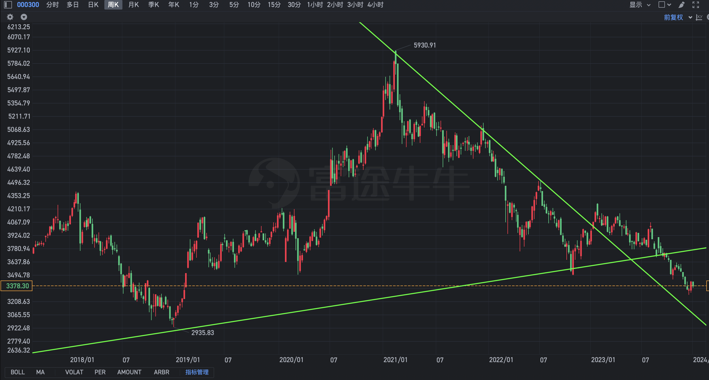
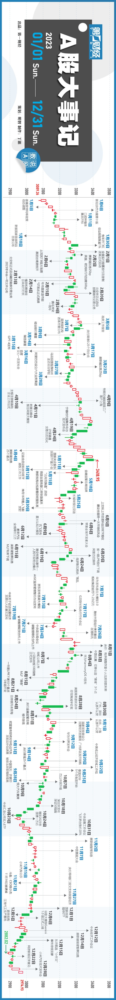
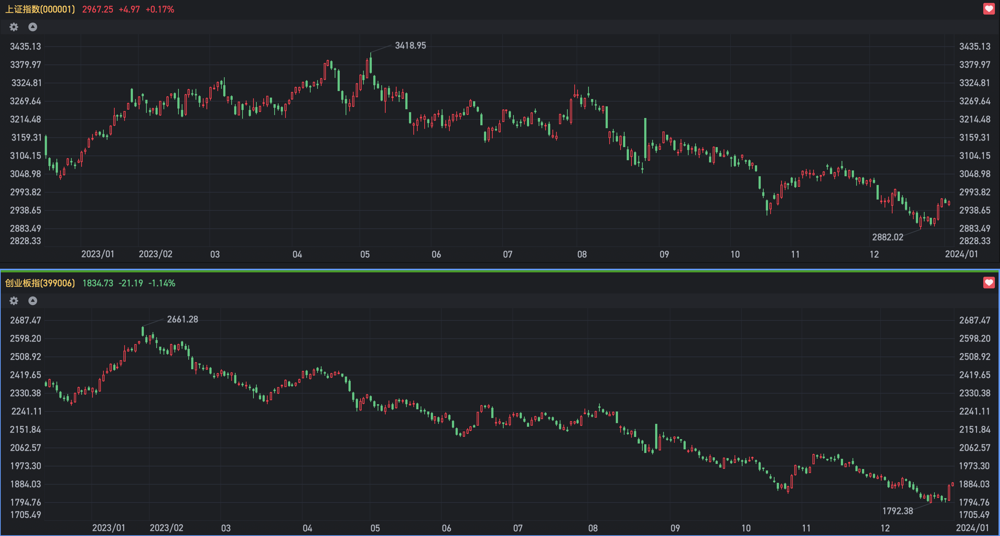
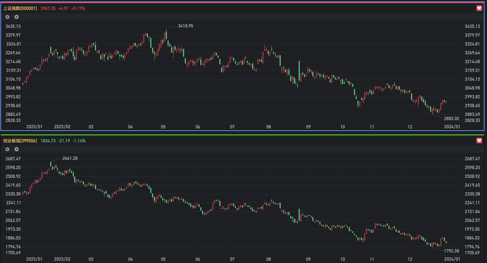
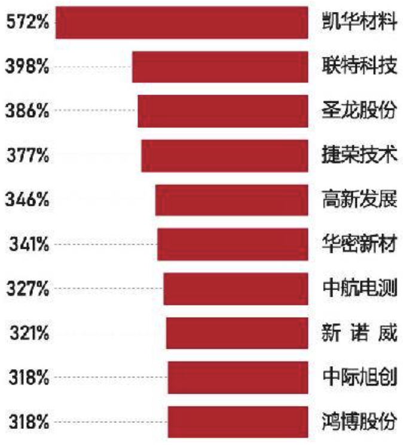

> 本文旨在还原我2023年的思想层次和思考方向

主要想法：

- 我们是否是这个世界的中心？

- 世界是客观的还是主观的？即为什么要按照'我'的想法运行？

- 投资三要素：企业、市场、人性

# 企业

今年企业分析算是入门了，去年的时候不知道该如何分析一家企业。比如对双汇的研究十分粗浅，觉得这家公司没什么好看的，粗看了各项业务的数据：营收、利润、分红，以及公司历史上发生过的事情。

今年再看的时候，确立了纵横两条线，纵向的是行业空间，横向的是竞争格局，个人更偏向良好的竞争格局即企业有自己的护城河。然后用这种思路研究了牧原和美团。

下面是主要研究的几点摘要，算是对过往思路的整理，主要有经过深入分析的牧原、美团，遭遇失败的劲嘉股份、FFIE、YANG、瑞士信贷：

<strong style="color:red;">1、牧原</strong>：

1. 处于养猪行业，需求稳定，缓慢下滑
2. 竞争激烈，产品没有差异化，公司的优势是成本低。实现这种优势是通过一定的技术领先+管理领先
3. 未来低成本优势是否可持续？可以，主要依靠管理领先。原因是集团养殖的精耕细作和权责统一，领先于公司农户合作的粗犷养殖，其他企业要实现牧原的发展模式，需要建猪舍，但生猪养殖已经过了发展的红利期，牧原的低成本会拉低整体行业的售价，造成其他企业获利减少，难以有现金流支撑投资，也难以在资本市场募资。牧原的管理领先是需要基础设施支撑的，很那被其他企业追赶
4. 秦英林的长期专注，30年只专注于养猪，不做饲料、不做预制菜、不做养鸡养鸭，屠宰也是有非瘟后异地运输困难才开始做的；灵活不死板，在2023年牧原舆论很差的时候，也敢于让东北部分猪场实行承包制，并不是用了集团制就死捏着集团制，做艰难且正确的事情；公司管理层诚信透明，对股东友好，在股价30时，管理层多次大额购买；

<strong style="color:red;">2、美团</strong>：

1. 管理层（王兴）长期有耐心，善于思考，善于设计公司；组织效率高，变革能力强；美团的组织是一个需要深入研究的问题；

2. 行业空间分业务：外卖趋于稳定；闪购增速50%+，但即时零售空间有限；买菜仍然季亏50亿，但给美团带来2亿用户；核心利润为到店业务，面临抖音竞争，但整体行业渗透率不高17%左右，增速40%；外卖+到店季度利润大约100亿+；

3. 竞争少，但利润低；外卖稳坐第一，主要对手饿了吗，目前看不到被超越的可能；买菜和拼多多竞争；闪购的对手主要是京东，但规模较小；真正的问题在于核心业务到店，和抖音竞争，下面谈谈当时买入时，对到店业务的分析：

   1. 到店分三块，商家、平台和用户
   2. 商家的利益在于从平台获取成本更低、效率更高的客户
   3. 用户的利益在于从平台获取数量更丰富、价格更便宜的产品或服务
   4. 平台撮合交易，谁能更好的满足用户和商家双方的利益，谁就能占有更多的市场份额

   5. 不同体量的商家在抖音上的差异：	
      1. 品牌KA商家可以在抖音混的很好，他们有专业的直播、短视频、运营团队以及充沛的广告预算，适合抖音的体系（中国1000家以上的品牌连锁店还很少，90%属于长尾商家）
      2. 长尾商家很难在抖音存活，比如家附近3km的饭店，它们整体利润率低，营销投入不会高，且直播、短视频以及抖音服务商对接都需要花钱，在抖音上的运营成本会很高，流失率也会很高

   6. 用户心智：
      1. 美团的团券对齐跟抖音一样，抖音销量立马下滑一半，所以美团防御抖音最有利的武器是价格战，甚至某种程度能让抖音的流量成为美团的红利（是否偏乐观？）
      2. 美团是目的消费，核销率高80-90%，抖音属于冲动性消费，核销率低 30-40%
      3. 和电商下单即交易完成闭环不一样，团券到店下单后，还需要去店铺使用。时间越长，用户消费冲动越少。可能刚开始深夜看到火锅店的短视频很想吃买了券，但过两天没这个兴趣了，就退了或者放着不管了
   7. 货架搜索：目前抖音靠短视频推送附带团券信息，如果抖音搜索货架模式占比提高，用户养成在抖音搜索团券的习惯，会对美团造成一定冲击，但不致命。这两个APP工具属性同样的强，就导致大家打开美团就是点外卖或者买团券，大家打开抖音就想刷短视频，以至于忽略了顶部其他的栏目
   8. 到店目前属于增长期，抖音的烧钱烧流量有助于扩大市场份额

4. 私人投资原因：想要找一家公司，观察人们生活方式的变化，美团是个合适的抓手；

   ​	

<strong style="color:red;">3、劲嘉股份</strong>：

2023/03/27 买入 仓位 10%

买入理由为：

1. 估值端：公司整体PE在15~20倍波动，买入的时候为12PE，估值比较低，希望赚价值回归的钱
2. 需求端：烟草行业需求比较稳定，在经济下行周期里也能保持正常的营收
3. 供给端：依赖各种关系生长，没有一定的"关系"新进入者难以进入

2023/07/17 卖出，盈亏 -8%

1. 未来不确定性太大，而且无法把握（董事长5月份被立案调查）
2. 核心产品烟标的营收逐年下滑，不清楚是什么情况（被烟草公司抛弃了吗？:)，新产品增收不增利
3. 分红迟迟没有具体的日期

综上：企业供给端竞争力有限，大多依靠关系获取订单，不是自身实力，不够稳定。今后应当避免生命线不在自己手上的企业，多找有自己护城河的企业。

<strong style="color:red;">FFIE、瑞士信贷</strong>：
这两笔投资我并没有太过分析，FFIE更多的是盲目乐观的幻想，想着贾跃亭的车如果真的造好交付，能涨几百倍，自己也知道失败的风险更大，但还是拿出一部分仓位来"赌"，我至今无法判断贾老板是真的在造车，还是为了割韭菜在表演，他如果在表演的话，算下来也没有赚到钱，为什么呢？买FFIE的时候，真的容易满脑子十倍百倍的幻想，一个亏损的概念股，很容易放大内心的贪婪，因为不知道边界和明确的盈利，所以更无知，更乐观，更盲目，更激昂。

瑞士信贷更多的是没想到，没想到它会被瑞银合并，没想到瑞士的银行业会采取这样的方式度过寒冬，这波也认了，内心并没有什么情绪，如果再来一次大概还是这样的操作。

截止目前FFIE为-96%，瑞士信贷退市前为-80%

这三笔印象较深的亏损，一方面是在我整体仓位不大的情况下、在我深入分析的投资标的没有构建多少的时候做出的仓皇的反应，另一方面害怕A股、美股走牛，如果什么仓位都没有配置错失涨幅心里会很难受。

# 市场

2023年市场表现：

1、指数涨跌幅

-   涨跌幅/振幅
-   成交量/成交额
-   换手率
-   最高价/最低价

| 指数     | 成交额  | 涨跌幅  | 最高价   | 最低价 | 振幅 |
| -------- | ------- | ------- | --------  | -------- |-------- |
| 上证指数 | 89万亿  | -3.7%   | 3418.95  | | |
| 深证成指 | 123万亿 | -13.54% | 12246.01 | | |
| 创业板指 | 53万亿  | -19.41% | 2661.28  | | |

https://36kr.com/p/2586725658748295

2、十大牛股

### 学习

中国证券市场批判
